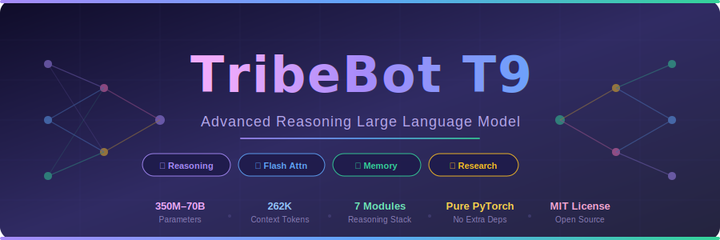
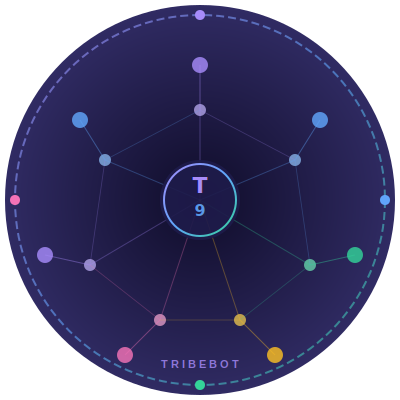

<p align="center">
  
</p>
<!-- Badges -->
<a href="https://github.com/dhaval-vedra/TribeBot-T9/stargazers">
  
</a>
<a href="https://github.com/dhaval-vedra/TribeBot-T9/forks">
  
</a>
<a href="https://github.com/dhaval-vedra/TribeBot-T9/blob/main/LICENSE">
  
</a>
<a href="#">
  
</a>
<a href="#">
  
</a>
<a href="#">
  
</a>

<br/><br/>



<br/>

### *The most feature-rich open-source reasoning LLM architecture — built for researchers who want everything in one place.*

<br/>

</div>

---

## ✨ What Makes T9 Different?

Most open-source LLM codebases give you **just a transformer**. TribeBot T9 ships **7 reasoning systems**, **3-scale memory**, **multi-rank LoRA**, **Graph + Causal + Mathematical reasoning** — all merged, all fixed, all working on CPU or GPU out of the box.

> This is a **research prototype** — designed for academics, AI enthusiasts, and engineers who want to study and experiment with advanced LLM reasoning architectures.

---

## 📋 Table of Contents

- [✨ What Makes T9 Different?](#-what-makes-t9-different)
- [🚀 Features](#-features)
- [🏗️ Architecture](#️-architecture)
- [📁 Project Structure](#-project-structure)
- [⚡ Quick Start](#-quick-start)
- [🎛️ Model Presets](#️-model-presets)
- [🔧 Configuration](#-configuration)
- [🧪 Testing](#-testing)
- [🏋️ Training](#️-training)
- [💬 Text Generation](#-text-generation)
- [📊 Performance](#-performance)
- [🗺️ Roadmap](#️-roadmap)
- [🤝 Contributing](#-contributing)
- [📄 License](#-license)
- [📚 Citation](#-citation)

---

## 🚀 Features

<table>
<tr>
<td width="50%">

### 🧠 Advanced Reasoning Stack
- **Recursive Self-Refinement** — quality-critique loop that iteratively improves outputs
- **Internal Multi-Agent Debate** — 3 parallel agents reach consensus before producing output
- **World Model** — GRU-based predictive simulation with validity gating
- **MetaCognition** — uncertainty-aware self-regulation with per-task goal tracking

</td>
<td width="50%">

### 🔬 Structural Reasoning
- **Graph Reasoner** — pure-PyTorch attention-based relational reasoning (zero external deps)
- **Causal Inference** — do-calculus inspired reasoning, fixed Pearl's intervention operator
- **Mathematical Reasoner** — symbolic encoder + proof checker for math-heavy tasks

</td>
</tr>
<tr>
<td>

### 💾 3-Scale Episodic Memory
- **Short-term** — raw experience vectors (fast, 50-item buffer)
- **Medium-term** — transformer-encoded summaries (200-item buffer)
- **Long-term** — GRU-consolidated memories (500-item buffer)
- Cross-attention based retrieval — models attend to relevant past context

</td>
<td>

### ⚡ Production Attention
- **Grouped Query Attention (GQA)** — fewer KV heads → lower memory at scale
- **Learnable RoPE** — rotary position embeddings with trainable frequency bias
- **Flash Attention v2** — optional GPU kernel, auto-fallback to PyTorch SDPA
- **KV Cache** — fast autoregressive decoding

</td>
</tr>
<tr>
<td>

### 🎛️ Adaptation & Efficiency
- **Multi-Rank LoRA** — blends rank-4, 8, 16 adapters via learned soft attention weights
- **Multi-Gate SwiGLU FFN** — extra gating paths for richer feed-forward dynamics
- **Advanced RMSNorm** — per-element scale + global affine α/β parameters
- **Semantic Dynamic Vocab** — runtime vocabulary expansion with semantic init

</td>
<td>

### 🛠️ Training Infrastructure
- Mixed precision (`bfloat16 / float16 / float32`) — modern `torch.amp` API
- Gradient accumulation + gradient clipping
- Cosine LR schedule with linear warmup
- Checkpoint save / resume
- Optional Weights & Biases integration

</td>
</tr>
</table>

---

## 🏗️ Architecture

```
                        ┌─────────────────────────────────────────┐
                        │          Input Token IDs [B, T]         │
                        └───────────────────┬─────────────────────┘
                                            │
                        ┌───────────────────▼─────────────────────┐
                        │  SemanticDynamicVocab + PosEmbedding    │
                        └───────────────────┬─────────────────────┘
                                            │
                        ╔═══════════════════▼═════════════════════╗
                        ║          TribeBotBlock  × N             ║
                        ║                                         ║
                        ║  ┌─────────────────────────────────┐   ║
                        ║  │   AdvancedHierarchicalMemory     │   ║
                        ║  │   Short ──► Medium ──► Long-term │   ║
                        ║  └──────────────┬──────────────────┘   ║
                        ║                 │                        ║
                        ║  ┌──────────────▼──────────────────┐   ║
                        ║  │         GraphReasoner            │   ║
                        ║  │  (pure-PyTorch message passing)  │   ║
                        ║  └──────────────┬──────────────────┘   ║
                        ║                 │                        ║
                        ║  ┌──────────────▼──────────────────┐   ║
                        ║  │        CausalInference           │   ║
                        ║  │   (do-calculus, interventions)   │   ║
                        ║  └──────────────┬──────────────────┘   ║
                        ║                 │                        ║
                        ║  ┌──────────────▼──────────────────┐   ║
                        ║  │   GroupedQueryAttention + RoPE   │   ║
                        ║  │      + MultiRankLoRA adapters    │   ║
                        ║  └──────────────┬──────────────────┘   ║
                        ║                 │                        ║
                        ║  ┌──────────────▼──────────────────┐   ║
                        ║  │    FFNBlock (MultiGateSwiGLU)    │   ║
                        ║  └──────────────┬──────────────────┘   ║
                        ║                 │                        ║
                        ║  ┌──────────────▼──────────────────┐   ║
                        ║  │      MathematicalReasoner        │   ║
                        ║  └──────────────┬──────────────────┘   ║
                        ╚═══════════════════▼═════════════════════╝
                                            │
              ┌─────────────────────────────▼──────────────────────────────┐
              │                  High-Level Reasoning Stack                 │
              │  InternalDebate → RecursiveRefiner → MetaCognition → WorldModel │
              └─────────────────────────────┬──────────────────────────────┘
                                            │
                        ┌───────────────────▼─────────────────────┐
                        │       AdvancedRMSNorm  →  LM Head       │
                        └───────────────────┬─────────────────────┘
                                            │
                        ┌───────────────────▼─────────────────────┐
                        │          Logits / Loss [B, T, V]        │
                        └─────────────────────────────────────────┘
```

---

## 📁 Project Structure

```
TribeBot-T9/
│
├── 📄 README.md                     ← You are here
├── 📄 requirements.txt              ← Python dependencies
├── 📄 setup.py                      ← pip installable package
├── 📄 CONTRIBUTING.md               ← How to contribute
├── 📄 LICENSE                       ← MIT License
├── 📄 .gitignore
│
├── 🖼️  assets/
│   ├── logo.svg                     ← Project logo
│   └── banner.svg                   ← GitHub banner
│
├── ⚙️  configs/
│   ├── model_config.py              ← ModelPresets (debug/small/medium/large/ultra)
│   └── training_config.py          ← TrainingPresets
│
├── 🧠 src/tribebot/
│   ├── model/
│   │   ├── normalization.py         ← RMSNorm, AdvancedRMSNorm
│   │   ├── embeddings.py            ← LearnableRoPE, SemanticDynamicVocab
│   │   ├── lora.py                  ← LoRALayer, MultiRankLoRA
│   │   ├── memory.py                ← 3-Scale AdvancedHierarchicalMemory
│   │   ├── reasoning.py             ← 7 reasoning modules
│   │   ├── attention.py             ← GQA, MultiGateSwiGLU, FFNBlock
│   │   └── tribebot.py              ← TribeBotT9 main model
│   │
│   ├── training/
│   │   └── trainer.py               ← Full training loop with AMP + checkpointing
│   │
│   └── utils/
│       ├── generation.py            ← top-k/p sampling, repetition penalty
│       └── logging_utils.py         ← Structured logging, W&B integration
│
├── 📜 scripts/
│   ├── train.py                     ← Training entry point
│   ├── evaluate.py                  ← Perplexity evaluation
│   └── generate.py                  ← Text generation from checkpoint
│
└── 🧪 tests/
    └── test_syntax.py               ← 3-level smoke tests (syntax/import/forward)
```

---

## ⚡ Quick Start

### 1️⃣ Clone the repository

```bash
git clone https://github.com/dhaval-vedra/TribeBot-T9.git
cd TribeBot-T9
```

### 2️⃣ Install PyTorch

Follow the official guide for your CUDA version:
```bash
# CUDA 12.1 (recommended)
pip install torch torchvision torchaudio --index-url https://download.pytorch.org/whl/cu121

# CPU only
pip install torch torchvision torchaudio
```

### 3️⃣ Install TribeBot T9

```bash
# Editable install (recommended for development)
pip install -e .

# Or install from requirements
pip install -r requirements.txt
```

### 4️⃣ Run smoke tests (no GPU needed)

```bash
python tests/test_syntax.py
```

Expected output:
```
======================================================================
  TribeBot T9 — Smoke Tests
  Python  : 3.11.x
  PyTorch : 2.1.x
======================================================================

  Level 1: Syntax checks (always runs)
──────────────────────────────────────────────────────────────────────
[ PASS ] syntax: configs/__init__.py
[ PASS ] syntax: src/tribebot/model/tribebot.py
  ... (24 files total)

  Level 2: Import checks
[ PASS ] import: src.tribebot.model.normalization
  ...

  Level 3: Component shape tests
[ PASS ] component: RMSNorm
[ PASS ] component: GraphReasoner
  ...

  RESULTS  passed=37  failed=0  skipped=0
  ALL TESTS PASSED ✓
======================================================================
```

### 5️⃣ Use in your own code

```python
import torch
from src.tribebot import TribeBotT9, TribeBotConfig
from src.tribebot.utils.generation import generate_text
from transformers import AutoTokenizer

# Create a small model (runs on CPU for testing)
config = TribeBotConfig(
    vocab_size=50_257,
    embed_dim=512,
    num_heads=8,
    num_kv_groups=2,
    num_layers=6,
    max_seq_len=2048,
)

model = TribeBotT9(config)
print(model)
# TribeBotT9(layers=6, embed_dim=512, heads=8, params=42,317,824)

tokenizer = AutoTokenizer.from_pretrained("gpt2")
tokenizer.pad_token = tokenizer.eos_token

# Generate text
response = generate_text(
    model, tokenizer,
    prompt="The key to artificial general intelligence is",
    max_new_tokens=200,
    temperature=0.8,
    top_p=0.95,
)
print(response)
```

---

## 🎛️ Model Presets

Choose the right size for your hardware:

| Preset | Embed Dim | Heads | Layers | Context | ~Params | Min VRAM |
|:------:|:---------:|:-----:|:------:|:-------:|:-------:|:--------:|
| `debug` | 128 | 4 | 2 | 512 | 2M | CPU ✓ |
| `small` | 1024 | 16 | 24 | 32K | 350M | 24 GB |
| `medium` | 2048 | 16 | 24 | 131K | 1.3B | 40 GB |
| `large` | 4096 | 32 | 32 | 131K | 7B | 2× A100 |
| `ultra` | 8192 | 64 | 48 | 262K | 70B | 8× A100 |

```python
from configs.model_config import ModelPresets

# Pick your preset
config = ModelPresets.small()     # 350M params, A100 40GB
config = ModelPresets.large()     # 7B params, 2× A100
config = ModelPresets.debug()     # tiny, CPU testing
```

---

## 🔧 Configuration

All hyperparameters are dataclass-based — no YAML files needed:

```python
from src.tribebot.model.tribebot import TribeBotConfig
from src.tribebot.training.trainer import TrainingConfig

model_cfg = TribeBotConfig(
    vocab_size=50_257,
    embed_dim=2048,
    num_heads=16,
    num_kv_groups=4,          # GQA groups (must divide num_heads)
    num_layers=24,
    max_seq_len=131_072,      # up to 262K for ultra
    ffn_mult=4,
    dropout=0.05,
    lora_ranks=[4, 8, 16],    # multi-rank LoRA
    use_graph_reasoning=True,
    use_causal_inference=True,
    use_math_reasoning=True,
    use_world_model=True,
    use_internal_debate=True,
    use_recursive_refiner=True,
    use_metacognition=True,
)

train_cfg = TrainingConfig(
    learning_rate=3e-4,
    batch_size=8,
    gradient_accumulation_steps=4,   # effective batch = 32
    dtype="bfloat16",                # "float32" | "float16" | "bfloat16"
    warmup_steps=2000,
    max_steps=100_000,
    eval_interval=500,
    save_interval=1000,
    checkpoint_dir="checkpoints/",
)
```

---

## 🧪 Testing

The test suite has 3 levels:

```bash
# Full test (requires torch installed)
python tests/test_syntax.py

# Or with pytest
pip install pytest
pytest tests/ -v
```

| Level | What it checks | Requires |
|:-----:|:--------------|:--------:|
| **Level 1** | Python syntax of all 24 files | Nothing |
| **Level 2** | Module imports | `torch` |
| **Level 3** | Tensor shapes + full forward pass | `torch` (CPU OK) |

---

## 🏋️ Training

### Prepare your data

```python
# Tokenise your dataset and save as a 1-D LongTensor
import torch
from transformers import AutoTokenizer

tokenizer = AutoTokenizer.from_pretrained("gpt2")
text = open("my_corpus.txt").read()
token_ids = tokenizer.encode(text, return_tensors="pt").squeeze()

torch.save(token_ids, "data/train.pt")
torch.save(token_ids[:10000], "data/val.pt")  # small val split
```

### Start training

```bash
# Quick debug run (tiny model, 10 steps, CPU)
python scripts/train.py --preset debug --data_dir data/

# Small model — single A100
python scripts/train.py --preset small --data_dir data/ \
    --checkpoint_dir checkpoints/ --dtype bfloat16

# Resume from checkpoint
python scripts/train.py --preset small \
    --resume checkpoints/tribebot_t9_step5000_best.pt
```

### Monitor training

```bash
# TensorBoard
tensorboard --logdir logs/

# Weights & Biases (set wandb_project in TrainingConfig)
pip install wandb && wandb login
```

---

## 💬 Text Generation

```bash
python scripts/generate.py \
    --checkpoint checkpoints/tribebot_t9_step10000_best.pt \
    --prompt "Explain the theory of relativity like I'm 10 years old." \
    --max_new_tokens 300 \
    --temperature 0.8 \
    --top_p 0.95
```

Or programmatically:

```python
from src.tribebot.utils.generation import generate_text

response = generate_text(
    model, tokenizer,
    prompt="Prove that √2 is irrational. Show your working.",
    max_new_tokens=400,
    temperature=0.7,
    top_k=50,
    top_p=0.9,
    repetition_penalty=1.1,
    task="mathematics",       # feeds into MetaCognition goal tracker
)
```

---

## 📊 Performance

### Bugs Fixed from Original T7 + T8 Prototypes

| Bug | Severity | Fixed |
|:----|:--------:|:-----:|
| `EnhancedGPTBlock.__init__` incomplete — sub-modules referenced but undefined | 🔴 Critical | ✅ |
| `from torch.cuda.amp import autocast` — deprecated API | 🟡 Medium | ✅ |
| `CausalInference`: `.diag()` on non-square matrix → wrong shapes | 🔴 Critical | ✅ |
| `MathematicalReasoner`: tensor indexed as Python list (`content[b]`) | 🔴 Critical | ✅ |
| `GraphReasoner`: `networkx` dependency — not differentiable, not GPU-portable | 🟡 Medium | ✅ |
| `TribeBotT8.generate`: `reasoning_depth` kwarg passed to `forward()` which rejects it | 🔴 Critical | ✅ |
| `deep_reasoning_cycle`: ran all blocks twice — double compute | 🟡 Medium | ✅ |
| `AdvancedHierarchicalMemory.retrieve`: incorrect batch dimension broadcasting | 🔴 Critical | ✅ |
| `flash_attn_func` called with wrong tensor layout `[B,H,T,D]` instead of `[B,T,H,D]` | 🔴 Critical | ✅ |
| `WorldModel`: `sim_seq` blended with wrong dimensions | 🟡 Medium | ✅ |
| `scipy`, `faiss` imported but never needed | 🟢 Minor | ✅ |

### Optional Accelerations

| Feature | Speedup | How to Enable |
|:--------|:-------:|:-------------|
| Flash Attention 2 | 2–4× attention | `pip install flash-attn` (CUDA 11.8+) |
| BFloat16 training | ~2× throughput | `dtype="bfloat16"` in TrainingConfig |
| Fused AdamW | ~10% optimizer | automatic on CUDA |
| KV Cache decoding | ~5× generation | `use_cache=True` in generate |

---

## 🗺️ Roadmap

- [x] Grouped Query Attention (GQA)
- [x] Learnable Rotary Position Embeddings
- [x] Multi-Rank LoRA adapters
- [x] 3-Scale Episodic Memory
- [x] Graph + Causal + Mathematical Reasoning
- [x] Internal Debate + Recursive Refinement + World Model
- [x] Mixed Precision Training (torch.amp)
- [x] Flash Attention v2 support
- [ ] Mixture of Experts (MoE) FFN
- [ ] Distributed training (DDP / FSDP)
- [ ] RLHF / DPO fine-tuning script
- [ ] Quantisation (GPTQ / AWQ)
- [ ] Speculative decoding
- [ ] Multi-modal inputs (vision tokens)
- [ ] HuggingFace Hub upload script

---

## 🤝 Contributing

Contributions are welcome and appreciated! Please read [CONTRIBUTING.md](CONTRIBUTING.md) first.

```bash
# Fork, clone, create a branch
git checkout -b feature/your-feature-name

# Make your changes, then run tests
python tests/test_syntax.py

# Push and open a Pull Request
git push origin feature/your-feature-name
```

**Ways to contribute:**
- 🐛 Report bugs via GitHub Issues
- 💡 Suggest features or improvements
- 📖 Improve documentation
- 🧪 Add test cases
- ⚡ Optimise existing modules
- 🌍 Translate README

---

## 📄 License

This project is licensed under the **MIT License** — see [LICENSE](LICENSE) for details.

You are free to use, modify, and distribute this code for research and educational purposes.

---

## 📚 Citation

If you use TribeBot T9 in your research, please cite:

```bibtex
@misc{tribebot2025,
  title   = {TribeBot T9: A Unified Advanced Reasoning LLM Architecture},
  author  = {TribeBot Research Team},
  year    = {2025},
  url     = {https://github.com/dhaval-vedra/TribeBot-T9},
  note    = {Research prototype merging T7 and T8 architectures.
             Not for production deployment without further evaluation.}
}
```

---

## 🙏 Acknowledgements

This project builds on ideas from:

- **FlashAttention** — Dao et al. (2022, 2023)
- **RoPE** — Su et al. (2021) — Rotary Position Embedding
- **GQA** — Ainslie et al. (2023) — Grouped-Query Attention
- **LoRA** — Hu et al. (2021) — Low-Rank Adaptation
- **SwiGLU** — Shazeer (2020)
- **RMSNorm** — Zhang & Sennrich (2019)
- **Pearl's Do-Calculus** — Pearl (2000) — causal inference inspiration

---

<div align="center">

<br/>


<br/>

**Made with ❤️ for the AI Research Community**

<br/>

<a href="https://github.com/dhaval-vedra/TribeBot-T9/stargazers">
  
</a>
&nbsp;&nbsp;
<a href="https://github.com/dhaval-vedra/TribeBot-T9/issues">
  
</a>
&nbsp;&nbsp;
<a href="https://github.com/dhaval-vedra/TribeBot-T9/discussions">
  
</a>

<br/><br/>

*⭐ If this project helped you, please star it — it helps others find it too! ⭐*

</div>
# TribeBot-T9

